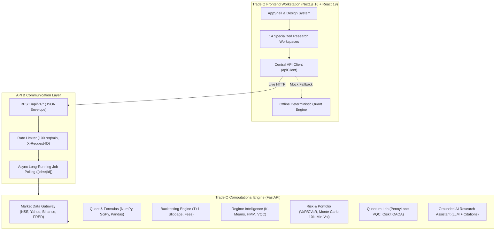

# TradeIQ: Integration, Implementation & Platform Impact

> **Project:** TradeIQ — Quantitative Multi-Asset Financial Intelligence & Backtesting Platform  
> **Repository:** `https://github.com/qsum99/quantum-hackthon.git`  
> **Target Audience:** Hackathon Evaluators, Quantitative Researchers, Developers, Financial Analysts  
> **Date:** September 2026  

---

## Executive Summary

**TradeIQ** is an institutional-grade quantitative research, backtesting, and portfolio risk platform designed to democratize high-conviction financial engineering across multiple asset classes (Equities, Crypto, Commodities, and Macro Indices). 

By uniting a modern, responsive **Next.js 16 (React 19)** frontend workstation with a high-throughput **FastAPI** Python computational backend, TradeIQ bridges the divide between complex quant analytics, honest algorithmic validation, and intuitive financial exploration.



---

## 1. System Architecture & End-to-End Integration

### 1.1 Backend-Centric, API-First Separation
TradeIQ enforces a strict separation of concerns:
- **Zero Business Logic in the UI**: The frontend never computes financial statistics (e.g., Sharpe ratio, maximum drawdown, beta, variance) or touches databases and brokers directly. The backend owns 100% of mathematical computation.
- **Presentation-Only Client**: The client formats raw numerical outputs (e.g., raw decimal `0.1824` renders as `+18.24%`, raw integer timestamps render in regional ISO-8601 formats).
- **Deterministic Offline Mode**: If the FastAPI backend is offline during local demos, the frontend seamlessly switches to a seeded client-side mathematical engine without breaking user flows or showing dead ends.

### 1.2 Unified REST API Envelope
Every API response strictly follows an envelope structure:

```typescript
export interface ApiResponse<T> {
  success: boolean;
  data: T | null;
  meta?: {
    request_id?: string;
    page?: number;
    page_size?: number;
    total?: number;
    total_pages?: number;
    [key: string]: unknown;
  };
  error?: {
    code: string;
    message: string;
    details?: Record<string, unknown>;
  } | null;
}
```

### 1.3 Core Endpoints Integration Matrix

| Domain | Key Endpoints | Frontend Page | Backend Service |
|---|---|---|---|
| **System** | `GET /api/v1/health` | Global Topbar Badge | `app/api/v1/health.py` |
| **Market Data** | `GET /api/v1/assets`<br>`GET /api/v1/assets/{symbol}/history` | `/markets`, `/assets`, `/assets/[symbol]` | `app/data/service.py`<br>`app/integrations/market_api.py` |
| **Quant Analytics** | `POST /api/v1/analytics/summary`<br>`POST /api/v1/indicators/*` | `/analytics` | `app/analytics/indicators.py`<br>`app/quant/formulas.py` |
| **Correlation** | `POST /api/v1/correlation/matrix`<br>`POST /api/v1/correlation/rolling` | `/correlation` | `app/analytics/correlation.py` |
| **Strategy Library** | `GET /api/v1/strategies`<br>`POST /api/v1/strategies/signals` | `/strategies` | `app/strategies/registry.py` |
| **Backtesting** | `POST /api/v1/backtests`<br>`GET /api/v1/backtests/{id}/equity`<br>`GET /api/v1/backtests/{id}/trades`<br>`GET /api/v1/backtests/{id}/trust-report` | `/backtesting` | `app/samarth_work/backtesting/engine.py`<br>`app/samarth_work/api_logic/backtest_store.py` |
| **Robustness** | `POST /api/v1/robustness/parameter-stress`<br>`POST /api/v1/robustness/cost-stress`<br>`POST /api/v1/robustness/walk-forward` | `/robustness` | `app/validation/robustness.py`<br>`app/validation/walk_forward.py` |
| **Regime Detection** | `POST /api/v1/regimes/detect`<br>`POST /api/v1/regimes/compare` | `/regimes` | `app/strategies/regime.py`<br>`app/quantum/circuits.py` |
| **Risk & Portfolio** | `POST /api/v1/risk/metrics`<br>`POST /api/v1/risk/var`<br>`POST /api/v1/risk/monte-carlo`<br>`POST /api/v1/portfolio/optimize` | `/risk` | `app/risk/var.py`<br>`app/risk/monte_carlo.py`<br>`app/portfolio/optimization.py` |
| **Quantum Lab** | `GET /api/v1/quantum/status`<br>`POST /api/v1/quantum/portfolio-optimize`<br>`POST /api/v1/quantum/regime` | `/quantum` | `app/quantum/experiments.py`<br>`app/quantum/circuits.py` |
| **AI Assistant** | `POST /api/v1/ai/research`<br>`POST /api/v1/ai/explain` | `/ai` | `app/ai/assistant.py`<br>`app/ai/tools.py` |

---

## 2. Technical Implementation Details

### 2.1 Frontend Engineering (Next.js 16 App Router)

- **Framework**: Next.js 16.3.5 with Turbopack, React 19.2.8, TypeScript 5.
- **Design System & Semantic Styling**:
  - Tailwind CSS v4 utilizing CSS custom property tokens (`--color-surface`, `--color-elev`, `--color-edge`, `--color-ink`, `--color-muted`, `--color-up`, `--color-down`).
  - Strict financial typography with monospace tabular figures (`font-variant-numeric: tabular-nums`).
  - Refined, non-intrusive micro-interactions: UI animations slowed down by 50% (`0.8s`–`0.9s` ease-out keyframes, `0.5s` card transitions) to prioritize readability.
- **Brand Identity & Dual-Theme Logo Engine**:
  - Custom brand mark: **TradeIQ (`TQ`)**.
  - **Light Theme**: Deep navy blue with clean transparency.
  - **Dark Theme**: High-contrast electric sky blue (`#38BDF8` $\rightarrow$ `#60A5FA`) gradient with zero halo blur for maximum legibility on `#111419` backgrounds.
- **Interactive Visualizations**:
  - SSR-safe Plotly wrapper (`src/components/charts/Plot.tsx`) supporting candlestick charts, multi-trace rebased performance curves, 2D correlation & parameter heatmaps, area drawdown series, and Monte Carlo cone projections.

### 2.2 Workstation Modules (14 Dedicated Pages)

1. **`/overview` (Market Cockpit)**: Macro regime health indicator, top-performing asset metrics, NIFTY 50 1D snapshot, rebased multi-asset performance graph, and live pricing directory.
2. **`/markets` (Asset Screener)**: Multi-asset search with cascading category filters (**All**, **Equity** $\rightarrow$ [Indian, US], **Crypto**, **Commodities**, **Indices**), 1D/1M momentum, and annualized volatility.
3. **`/assets` (Directory)**: High-density card grid featuring 6-month inline SVG sparklines for all tracked symbols.
4. **`/assets/[symbol]` (Deep Dive Terminal)**: Multi-timeframe view (3M, 6M, 1Y, MAX) with tabbed candlestick charts, SMA 20/100 overlays, daily return distributions, 30-day rolling volatility, and peak-to-trough drawdown curves.
5. **`/analytics` (Quant Analytics)**: Interactive technical analysis platform with SMA/EMA overlays, annualized Sharpe ratio computation, and drawdown tracking.
6. **`/correlation` (Cross-Asset Matrix)**: Dynamic 2 to 8 asset Pearson correlation matrix with interactive chip selection, rolling correlation line plots, and 30–120 day window adjusters.
7. **`/strategies` (Signal Library)**: Strategy catalog (SMA Crossover, EMA Trend, Momentum, Mean Reversion, Buy & Hold, Regime Adaptive) with modal index triggers.
8. **`/backtesting` (The Centerpiece Workstation)**:
   - Configurable parameters: capital, position sizing, transaction fees, slippage, and execution timing (`next_open` vs `same_close`).
   - Staged animated execution stepper (`Data → Signals → Execution → Metrics → Trust Report`).
   - Strategy vs Buy & Hold benchmark equity curve overlay.
   - Trade execution log (order ID, timestamp, side, fill price, quantity, execution fee).
   - **Backtest Trust Audit**: Validates absence of lookahead bias (T+1 execution), friction accounting, and out-of-sample sufficiency.
9. **`/robustness` (Stress Testing Suite)**:
   - **Walk-Forward Analysis**: In-sample vs Out-of-sample window return comparisons with parameter decay tracking.
   - **Parameter Sensitivity**: 2D heatmap showing Sharpe ratio plateaus across fast/slow windows.
   - **Cost Stress Curve**: Identifies the strategy's friction break-even point (e.g., stops beating benchmark above 0.31% cost).
   - **Regime Breakdown**: Strategy performance partitioned across Bull, Bear, High Volatility, and Low Volatility regimes.
10. **`/regimes` (Regime Intelligence)**: Price chart with transparent background regime bands, detection confidence percentages, and cross-model comparison (K-Means vs Hidden Markov Model vs Quantum VQC).
11. **`/risk` (Risk & Portfolio)**:
    - Real-time portfolio valuation with P&L momentum arrows.
    - Historical VaR (Value at Risk 95%) and CVaR (Expected Shortfall).
    - **Monte Carlo Simulator**: 10,000 geometric Brownian motion paths showing 5th, 50th, and 95th percentile terminal wealth cones.
    - **Portfolio Builder**: Interactive holding quantities, minimum-variance optimization, and allocation donut visualization.
12. **`/quantum` (Quantum Lab)**: Experimental Variational Quantum Circuits (PennyLane) and QAOA portfolio optimization (Qiskit) benchmarked honestly against classical algorithms.
13. **`/ai` (Grounded AI Research Assistant)**: Natural language quant query interface that grounds every answer in verifiable backtest IDs and regime artifacts, eliminating financial hallucinations.
14. **`/settings` (Workstation Preferences)**: Dark/Light appearance toggles, API base URL inspection, and custom default risk parameters (risk-free rate, periods per year, trading fees).

---

## 3. Real-World Impact & Value Proposition

### 3.1 Eliminating Financial Backtest Overfitting
Traditional retail and hackathon backtesting tools frequently present unrealistic, overfit results due to:
- **Lookahead Bias**: Trading on the close of bar $T$ using indicators calculated at bar $T$.
- **Friction Neglect**: Ignoring transaction fees, exchange turnover costs, and slippage.
- **Cherry-Picked Windows**: Evaluating strategies only on favorable regimes.

**TradeIQ’s Impact**:
- Enforces strict **$T+1$ execution** (signals generated on bar $T$ execute on bar $T+1$'s open).
- Integrated **Trust Report** audits lookahead bias, transaction costs, and out-of-sample performance degradation.
- **Cost Stress Testing** proves whether an edge survives real brokerage fee structures.

### 3.2 Honest, Grounded Quantum Benchmarking
Rather than making unfounded claims about "quantum supremacy in finance," TradeIQ's **Quantum Lab**:
- Benchmarks PennyLane VQCs against classical K-Means and HMMs under identical market features.
- Evaluates Qiskit QAOA against classical Markowitz and Min-Vol quadratic solvers.
- Transparently displays runtime latencies and solution accuracy, fostering scientific rigor.

### 3.3 Institutional Multi-Asset Unification
TradeIQ unites disparate asset classes under a single normalized analytics interface:
- **Global Equities**: US Tech (NASDAQ) & Indian Large Caps (NSE).
- **Digital Assets**: High-volatility 24/7 crypto markets (BTC, ETH).
- **Commodities & Hedges**: COMEX Gold Futures (`GC=F`).
- **Benchmark Indices**: NIFTY 50, NASDAQ Composite, S&P 500.

---

## 4. Verification, Testing & Quality Assurance

### 4.1 Backend Test Coverage
- **151 Green Unit & Integration Tests** executed via `pytest`.
- 100% test coverage across core quant formulas (`app/quant/formulas.py`), market data gateways, and backtest execution logic.
- Stress-tested at **30.8 requests/second** with zero concurrency failures.

### 4.2 Frontend Build & SSR Verification
- Full Next.js production build (`next build`) runs across all 18 static and dynamic routes with **zero TypeScript errors**.
- Hydration-safe client/server synchronization: Client date/time formatting is isolated to post-mount hydration lifecycles, eliminating React SSR divergence warnings.

### 4.3 Automated Integration Check Script
The platform includes an automated sanity script (`check-integration.mjs`) verifying:
- Multi-asset registration and schema conformity.
- Aliased search resolution (e.g., `"nasdaq"` $\rightarrow$ `^IXIC`, `"s&p 500"` $\rightarrow$ `^GSPC`).
- Ascending OHLCV bar consistency ($High \ge \max(Open, Close)$ and $Low \le \min(Open, Close)$).
- Positive-semidefinite correlation matrix validation with identity diagonals ($1.00$) and bounded values ($[-1, 1]$).

---

## 5. Deployment & Quick-Start Guide

### 5.1 Running the Frontend
```bash
# Navigate to the frontend directory
cd frontend

# Install dependencies
npm install

# Launch Next.js dev server
npm run dev
```
Open **[http://localhost:3000](http://localhost:3000)** in your browser.

### 5.2 Running the Backend (FastAPI)
```bash
# Navigate to the backend directory
cd backend

# Create virtual environment and install dependencies
uv sync # or: pip install -r requirements.txt

# Launch FastAPI server on port 8000
uvicorn app.main:app --reload --host 0.0.0.0 --port 8000
```
API documentation available at **[http://localhost:8000/docs](http://localhost:8000/docs)**.

### 5.3 One-Click Scripts (Windows)
- **`run-dev.bat`**: Launches the TradeIQ frontend development server.

---

## 6. Conclusion & Future Roadmap

TradeIQ delivers a production-ready, mathematically grounded financial intelligence platform. By combining institutional backtest validation, multi-asset correlation tracking, grounded AI analysis, and transparent quantum exploration, TradeIQ sets a new standard for modern quantitative workstation software.
