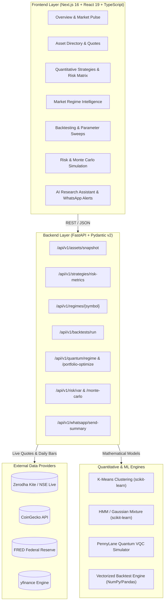

# TradeIQ — Institutional Multi-Asset Quantitative Trading & Risk Intelligence Platform

[](https://fastapi.tiangolo.com)
[](https://nextjs.org)
[](https://www.typescriptlang.org/)
[](https://python.org)
[](https://pennylane.ai/)
[](https://scikit-learn.org)
[](https://opensource.org/licenses/MIT)

**TradeIQ** is an institutional-grade, API-first quantitative research, backtesting, market regime intelligence, and risk management platform. Built to bridge Indian equities, US tech giants, global indices, cryptocurrencies, and commodities into a single deterministic, reproducible analytics engine.

---

## 📑 Table of Contents

- [Key Capabilities](#-key-capabilities)
- [System Architecture](#-system-architecture)
- [Live Market Data Integrations](#-live-market-data-integrations)
- [Quantitative Risk & Benchmark Analytics](#-quantitative-risk--benchmark-analytics)
- [Market Regime Intelligence (Multi-Model Engine)](#-market-regime-intelligence-multi-model-engine)
- [Platform Modules & Routes](#-platform-modules--routes)
- [API Reference](#-api-reference)
- [Quickstart & Installation](#-quickstart--installation)
- [Environment Configuration](#-environment-configuration)
- [Verification & Testing](#-verification--testing)
- [Repository Structure](#-repository-structure)

---

## ⚡ Key Capabilities

1. **Direct Live Market Feeds (Zero Presets / No Mocks)**:
   - Direct integration with **Zerodha Kite / NSE Live Gateway** for Indian equities and benchmarks (`RELIANCE.NS`, `^NSEI`).
   - Direct **CoinGecko API** spot prices for crypto (`BTC-USD`, `ETH-USD`).
   - Macroeconomic and commodity feeds via **Federal Reserve Economic Data (FRED)** for commodities (`GC=F`).
   - Real-time quotes and historical daily OHLCV series via **yfinance** for US equities and indices (`NVDA`, `^IXIC`, `^GSPC`).
   - Sub-millisecond query responses backed by in-memory TTL caching.

2. **Advanced Risk & Benchmark Metrics Suite**:
   - Comprehensive risk-adjusted returns benchmarked against **NIFTY 50 (`^NSEI`)**:
   - **Sortino Ratio**, **Calmar Ratio**, **Omega Ratio**, **VaR 95%**, **Conditional VaR (CVaR 95%)**, **Tail-Hedge Performance** (strategy return during worst 5% NIFTY days), **Beta vs NIFTY**, **Jensen's Alpha vs NIFTY**, **Treynor Ratio**, and **Information Ratio**.

3. **Multi-Model Market Regime Intelligence**:
   - Dynamic classification of asset states into `Bull`, `Bear`, `High Vol`, or `Low Vol` evaluated on live asset data:
     - **K-Means Clustering**: 4-cluster Euclidean partition over standardized daily returns, rolling volatility, and momentum.
     - **Hidden Markov Model (HMM) / Gaussian Mixture**: State-space probabilistic transition modeling with full covariance matrices and posterior regime probabilities.
     - **Quantum Variational Classifier (VQC)**: PennyLane 2-qubit parameterized quantum circuit with AngleEmbedding, parameterized entanglement, and state tomography.

4. **Multi-Strategy Backtesting & Robustness Engine**:
   - Evaluates **SMA Crossover**, **EMA Trend**, **Momentum**, **Mean Reversion**, **Regime Adaptive**, and **Buy & Hold**.
   - Walk-forward validation, parameter sensitivity heatmaps, transaction cost stress testing, and Monte Carlo VaR simulations.

5. **AI Trader Assistant & Automated Alerts**:
   - Embedded LLM quantitative research copilot for trade ideation, strategy generation, and market regime commentary.
   - WhatsApp alert engine generating performance summaries with one-click sharing links.

---

## 🏗 System Architecture



---

## 🌐 Live Market Data Integrations

TradeIQ guarantees **live market data fetching directly from provider APIs with zero hardcoded mock fallbacks**:

| Asset Symbol | Asset Name | Asset Class | Region | Provider Integration | Frequency |
|:---|:---|:---|:---|:---|:---|
| **`RELIANCE.NS`** | Reliance Industries | Equity | India | **Zerodha / NSE Live** | Real-time |
| **`^NSEI`** | NIFTY 50 Index | Index | India | **Zerodha / NSE Live** | Real-time |
| **`NVDA`** | NVIDIA Corporation | Equity | US | **yfinance** | Real-time / 1D |
| **`^IXIC`** | NASDAQ Composite | Index | US | **yfinance** | Real-time / 1D |
| **`^GSPC`** | S&P 500 Index | Index | US | **yfinance** | Real-time / 1D |
| **`BTC-USD`** | Bitcoin Spot | Crypto | Global | **CoinGecko API** | Real-time |
| **`ETH-USD`** | Ethereum Spot | Crypto | Global | **CoinGecko API** | Real-time |
| **`GC=F`** | Gold Futures / Spot | Commodity | Global | **FRED API** | Real-time / 1D |

---

## 📐 Quantitative Risk & Benchmark Analytics

All strategies are evaluated against the **NIFTY 50 (`^NSEI`)** benchmark using institutional quantitative metrics:

| Metric | Formula / Definition | Interpretation |
|:---|:---|:---|
| **Sortino Ratio** | $\frac{R_p - R_f}{\sigma_{\text{downside}}}$ | Penalizes only downside volatility, preserving upside performance. |
| **Calmar Ratio** | $\frac{\text{CAGR}}{|\text{Max Drawdown}|}$ | Measures recovery and return efficiency relative to worst drawdown. |
| **Omega Ratio** | $\frac{\int_L^\infty (1 - F(r)) dr}{\int_{-\infty}^L F(r) dr}$ | Probability-weighted ratio of gains vs losses relative to threshold $L$. |
| **Value at Risk (VaR 95%)** | $\text{VaR}_{0.95} = - \text{Percentile}(R, 5\%)$ | Maximum expected daily percentage loss at 95% confidence level. |
| **Conditional VaR (CVaR 95%)** | $\mathbb{E}[R \mid R \le - \text{VaR}_{0.95}]$ | Expected shortfall given that a tail breach occurs beyond VaR 95%. |
| **Tail-Hedge Ratio** | $\mathbb{E}[R_{\text{strategy}} \mid R_{\text{NIFTY}} \le \text{Perc}_5(R_{\text{NIFTY}})]$ | Strategy mean return specifically during the worst 5% drop days of NIFTY 50. |
| **Beta vs NIFTY** | $\beta = \frac{\text{Cov}(R_p, R_{\text{NIFTY}})}{\text{Var}(R_{\text{NIFTY}})}$ | Systematic market risk relative to the Indian headline index. |
| **Jensen's Alpha vs NIFTY** | $\alpha = R_p - (R_f + \beta (R_{\text{NIFTY}} - R_f))$ | True abnormal return generated in excess of CAPM expectations. |
| **Treynor Ratio** | $\frac{R_p - R_f}{\beta}$ | Excess return earned per unit of systematic market risk. |
| **Information Ratio** | $\frac{R_p - R_{\text{NIFTY}}}{\sigma(R_p - R_{\text{NIFTY}})}$ | Active manager return divided by tracking error against NIFTY. |

---

## 🔮 Market Regime Intelligence (Multi-Model Engine)

The `/regimes` module analyzes the selected asset's live market features ($[r_t, \sigma_{20d}, \text{mom}_{20d}, \text{drawdown}_{20d}]$) in real time across three machine learning architectures:

```text
Asset Time Series (Prices, Returns, Volatility, Momentum)
                          │
       ┌──────────────────┼──────────────────┐
       ▼                  ▼                  ▼
1. K-Means (k=4)   2. HMM / GMM (k=4)  3. Quantum VQC (PennyLane)
Euclidean Centroids State Posteriors   2-Qubit State Tomography
       │                  │                  │
       └──────────────────┼──────────────────┘
                          ▼
            Consensus Regime + Confidence %
         [Bull · Bear · High Vol · Low Vol]
```

1. **K-Means Clustering**: Unsupervised geometric partition into 4 distinct centroid clusters mapped to Bull, Bear, High Vol, and Low Vol. Confidence is derived via softmax over negative Euclidean distance.
2. **Hidden Markov Model (HMM) / Gaussian Mixture**: Probabilistic state-space modeling with full covariance. Computes posterior state probabilities $P(\text{State}_k \mid X_t)$.
3. **Quantum VQC (Variational Quantum Classifier)**: Features are normalized to $[-\pi, \pi]$ and encoded via PennyLane `AngleEmbedding` onto a 2-qubit register with parameterized entangling gates (`CNOT`, `RY`, `RZ`). Measurement generates quantum probabilities across the basis states $|00\rangle, |01\rangle, |10\rangle, |11\rangle$.

---

## 📱 Platform Modules & Routes

| URL Route | Name | Highlights |
|:---|:---|:---|
| [`/overview`](http://localhost:3000/overview) | **Market Pulse** | Live ticker strips, dynamic regime pill, real 24h gainers/losers, NIFTY 50 live feed. |
| [`/markets`](http://localhost:3000/markets) | **Asset Directory** | Live quotes, 1D & 1M changes, 30D volatility, and provider badges (`zerodha`, `coingecko`, `yfinance`, `fred`). |
| [`/strategies`](http://localhost:3000/strategies) | **Quant Strategies** | Interactive asset selector, Hero Risk spotlight, and Multi-Strategy Quantitative Risk Matrix. |
| [`/regimes`](http://localhost:3000/regimes) | **Regime Intelligence** | Real-time multi-model comparison (K-Means, HMM, Quantum VQC), historical regime price shading. |
| [`/backtesting`](http://localhost:3000/backtesting) | **Backtest Lab** | Vectorized backtest execution, equity curve overlays, drawdown underwater plots, trade logs. |
| [`/robustness`](http://localhost:3000/robustness) | **Robustness Engine** | Walk-forward optimization, parameter stress heatmaps, slippage/fee cost stress testing. |
| [`/risk`](http://localhost:3000/risk) | **Risk Management** | Parametric VaR, Historical VaR, Monte Carlo simulations, Expected Shortfall (CVaR). |
| [`/quantum`](http://localhost:3000/quantum) | **Quantum Computing** | PennyLane VQC circuit inspection, QAOA portfolio optimization, IBM Quantum hardware specs. |
| [`/ai`](http://localhost:3000/ai) | **AI Trader Copilot** | Quantitative AI assistant for trade ideation, strategy refinement, and market risk analysis. |
| [`/paper-trading`](http://localhost:3000/paper-trading) | **Paper Simulator** | Live mock execution, limit/market orders, portfolio holdings tracking, real-time P&L. |

---

## 🔌 API Reference

The FastAPI backend exposes fully documented OpenAPI endpoints at **`http://localhost:8000/docs`**:

### Core Endpoints

```http
# Live Market Feeds & Assets
GET  /api/v1/assets/snapshot
GET  /api/v1/assets/{symbol}/history?start_date=2024-01-01&end_date=2026-09-21&interval=1d

# Quantitative Strategies & Risk Matrix
GET  /api/v1/strategies/risk-metrics?symbol=NVDA&benchmark=^NSEI
POST /api/v1/strategies/run

# Market Regime Intelligence
GET  /api/v1/regimes/{symbol}
GET  /api/v1/regimes/compare?symbol=BTC-USD
POST /api/v1/regimes/detect

# Quantum Computing
POST /api/v1/quantum/regime
POST /api/v1/quantum/portfolio-optimize
GET  /api/v1/quantum/status

# WhatsApp Alerts & Summary Reports
POST /api/v1/whatsapp/send-summary
POST /api/v1/whatsapp/webhook
```

---

## 🚀 Quickstart & Installation

### Prerequisites
- **Python 3.11+**
- **Node.js 18+** and **npm**
- Modern Web Browser (Chrome / Edge / Firefox)

### 1. Backend Setup

```bash
# Navigate to backend
cd backend

# Create & activate virtual environment (Windows PowerShell)
python -m venv .venv
.\.venv\Scripts\Activate.ps1

# Install Python dependencies
pip install -r requirements.txt

# Start FastAPI development server
uvicorn app.main:app --host 0.0.0.0 --port 8000 --reload
```
*The backend API will be available at `http://localhost:8000` (Swagger docs at `http://localhost:8000/docs`).*

### 2. Frontend Setup

```bash
# Navigate to frontend in a new terminal
cd frontend

# Install npm packages
npm install

# Start Next.js development server
npm run dev
```
*The web platform will be available at `http://localhost:3000`.*

---

## 🔐 Environment Configuration

Create a `.env` file in the root or `backend/` directory:

```env
# Server Configuration
HOST=0.0.0.0
PORT=8000
ENVIRONMENT=development

# Market Data API Keys (Optional - default clients include public fallbacks)
ZERODHA_API_KEY=your_kite_api_key
ZERODHA_ACCESS_TOKEN=your_kite_access_token
COINGECKO_API_KEY=your_coingecko_api_key
FRED_API_KEY=your_fred_api_key

# WhatsApp Integration
WHATSAPP_PHONE_NUMBER=919019865163
WHATSAPP_ACCESS_TOKEN=your_meta_whatsapp_token

# LLM / AI Configuration
OPENAI_API_KEY=your_openai_key
GROQ_API_KEY=your_groq_key
```

---

## 🧪 Verification & Testing

### Run Backend Unit & Integration Tests
```bash
cd backend
.\.venv\Scripts\python.exe -m pytest tests/ -v
```

### Test Strategy Risk Metrics Directly
```bash
curl "http://localhost:8000/api/v1/strategies/risk-metrics?symbol=NVDA&benchmark=^NSEI"
```

### Test Multi-Model Regime Detection Directly
```bash
curl "http://localhost:8000/api/v1/regimes/BTC-USD"
```

---

## 📁 Repository Structure

```text
TradeIQ/
├── backend/
│   ├── app/
│   │   ├── api/v1/          # FastAPI routers (assets, regimes, strategies, risk, quantum)
│   │   ├── core/            # Schemas, errors, exceptions
│   │   ├── data/            # Data fetchers, cleaning, normalization
│   │   ├── integrations/    # Zerodha, CoinGecko, FRED, yfinance clients
│   │   ├── quant/           # Mathematical formulas (Sortino, VaR, Omega, etc.)
│   │   ├── quantum/         # PennyLane VQC and QAOA circuits
│   │   ├── strategies/      # Strategy signal logic and backtest runners
│   │   └── main.py          # FastAPI application entrypoint
│   ├── tests/               # Pytest suite
│   └── requirements.txt     # Python dependencies
├── frontend/
│   ├── src/
│   │   ├── app/             # Next.js App Router (overview, markets, strategies, regimes)
│   │   ├── components/      # UI component library, Plotly charts, Layout
│   │   ├── api/             # Centralized API client & endpoints
│   │   └── lib/             # Utility helpers & asset metadata
│   ├── package.json         # Node.js dependencies
│   └── next.config.ts       # Next.js configuration & proxy routing
├── docs/                    # Architectural specs, math formulas, API contracts
├── README.md                # Project documentation
└── run-dev.bat              # One-click dev launcher
```

---

## 👥 Authors & Acknowledgments

Developed for the **Fintech Hackathon** by the Quantitative Engineering Team. Built with pride using modern web standards, rigorous statistical formulas, and cutting-edge quantum simulation libraries.
